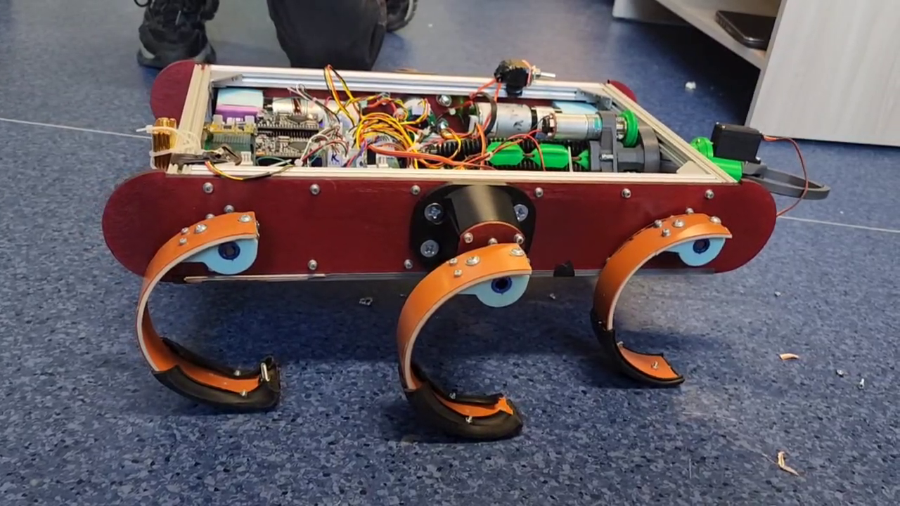
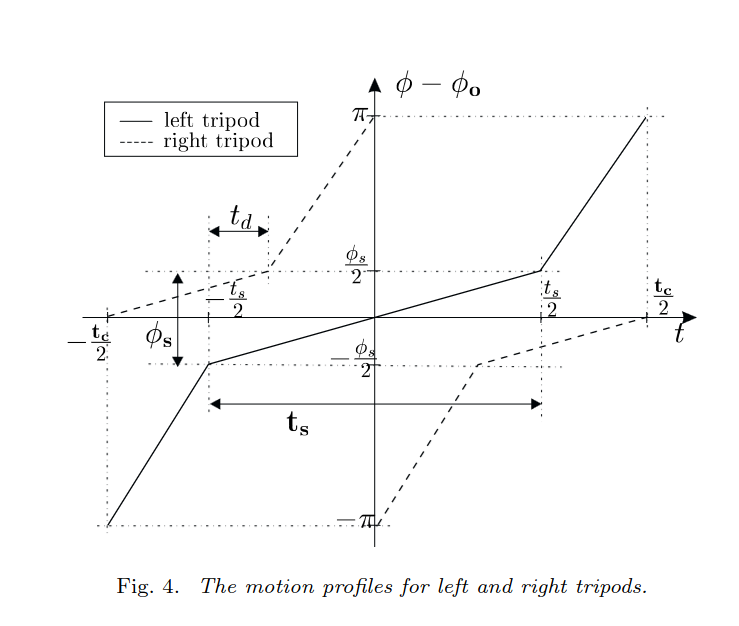

= Система управления шагающим роботом схемы RHex
Yarmolinskiy Arseniy <yarmolinskiyam@gmail.com>
v0.1.0, 14.06.2024
:doctype: book
:icons: font
:source-highlighter: highlightjs
:toc:
:stem: latexmath

:pobedrtk: [1]
:alfa4c: [2]
:desmos_math: [3]
:rhex_math: [4]
:alfa_gat: [5]

== Введение

Данный проект является пробой пера в управлении шестиногим роботом "Лапчик". Весь исходный код проекта можно найти в публичном репозитории {pobedrtk}.

.Робот Лапчик
[options="header,footer"]

== Схема управления

Для движения робота для каждой лапки определяется желаемое текущее положение в зависимости от траектории движения и текущей фазы циклограммы соответствующей лапки.
В дальнейшем этот угол отрабатывается шестью локальными П-ПИ регуляторами (по одному на каждую лапку).

Лапки объеденены в два так называемых "трипода":

.An example table
[options="header,footer"]
|=======================
|L|R

|R
|L

|L
|R

|=======================

Лапки внутри одного трипода синхронизированы и отрабатывают заранее заданный профиль движения.

Профиль движения левого и правого трипода отличаются по фазе на 180^o^.

Профиль лапки характеризуется параметрической функцией 

[stem]
++++
f\left(t,\ t_{c},\ t_{s},\ \phi_{s},\ \phi_{0}\right)
++++

Функция представляет из себя кусочно-линейную и связывает текущую фазу внутри циклограммы с требуемым углом лапки.

Математическое описание этой функции можно получить в {desmos_math}.

Реализация в коде приведена ниже:

[source,cpp]
----
include::include/RHex.h[]
----

Для управления углом каждой лапки была использована экспериментальная библиотека `ALFA4C` {alfa4c}, вдохновляющаяся языком программирования реактивных систем `ALFA` {alfa_gat}.

Исходный код приведен ниже:

[source,cpp]
----
include::include/RHex_modules.h[]
----

Для движения вперед основная программа должна выбрать соответствующий модуль `move_forward` и записать требуемую скорость в глобальную переменную `forward_vel`.

== Источники

{pobedrtk} "https://github.com/arsenier/PobeditelRTK"

{alfa4c} "https://github.com/arsenier/ALFA4C"

{desmos_math} "https://www.desmos.com/calculator/nokfdmo4bt"

{rhex_math} “https://www.rhex.web.tr/saranli_buehler_koditschek.ijrr2001.pdf.” Accessed: Jun. 08, 2024. [Online]. Available: https://www.rhex.web.tr/saranli_buehler_koditschek.ijrr2001.pdf

{alfa_gat} E. Gat, “ALFA: a language for programming reactive robotic control systems,” in Proceedings. 1991 IEEE International Conference on Robotics and Automation, Sacramento, CA, USA: IEEE Comput. Soc. Press, 1991, pp. 1116–1121. doi: 10.1109/ROBOT.1991.131743.
